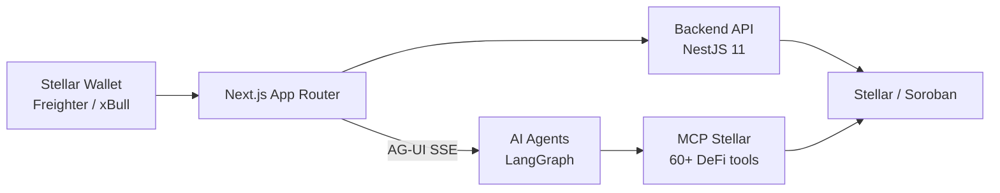

<p align="center">
  
</p>

<h1 align="center">Tasmil Finance</h1>

<p align="center">
  AI-powered DeFi portfolio management on Stellar/Soroban
</p>

<p align="center">
  
  
  
  
  
</p>

---

## Overview

The Tasmil Finance web application at [zyf.ai](https://zyf.ai) gives users a seamless interface to deploy and manage yield-generating vaults on Stellar. AI agents handle strategy selection, allocation, and rebalancing automatically while users interact through a real-time dashboard and conversational AI chat.

---

## Architecture



### Route Groups

| Group | Path | Purpose |
|-------|------|---------|
| Dashboard | `app/(dashboard)/` | Authenticated app — vault, portfolio, chat, strategies |
| Landing | `app/(landing-page)/` | Marketing pages |

---

## Features

- **Vault Dashboard** — Real-time portfolio view with APY, balance, and allocation breakdown per protocol
- **AI Chat** — Conversational interface backed by 13 specialized DeFi agents (Blend, Soroswap, Aquarius, research, yield, and more)
- **Onboarding Flow** — Connect wallet → choose base asset + risk preset → fund vault in 3 steps
- **Strategy Browser** — Explore live yield pools across Blend, Soroswap, and Aquarius
- **Multi-Asset** — Deploy USDC and XLM simultaneously with independent strategy allocation per asset
- **Session Keys** — Non-custodial vault access via Soroban keeper-wallet contracts — no signing prompts after setup

---

## Tech Stack

| Layer | Technology |
|-------|------------|
| Framework | Next.js 16 (App Router) |
| UI Components | React 19, TailwindCSS 4, Radix UI, shadcn |
| Wallet Integration | Stellar Wallets Kit (Freighter, xBull, WalletConnect) |
| AI Streaming | AG-UI Protocol — `@ag-ui/client` + SSE |
| Server State | TanStack Query v5 |
| Client State | Zustand (persisted to localStorage) |
| API Client | Kubb-generated React Query hooks (OpenAPI → TypeScript) |
| Unit Tests | Jest |
| E2E Tests | Playwright |
| Linting | Biome |

---

## Project Structure

```
src/
├── app/               # Next.js App Router pages & layouts
│   ├── (dashboard)/   # Authenticated routes: /vault, /portfolio, /chat…
│   └── (landing-page)/# Public marketing pages
├── features/          # Domain modules — each owns its UI, hooks, and state
│   ├── account/       # Vault onboarding, dashboard, settings
│   ├── chat/          # AI chat interface + AG-UI stream integration
│   ├── portfolio/     # Portfolio overview and history
│   ├── strategies/    # Strategy browser and details
│   └── farming/       # Yield farming flows
├── shared/            # Reusable primitives (UI components, hooks, utils)
├── gen/               # Auto-generated API client — do not edit
├── providers/         # Global providers: wallet, QueryClient, theme, chat stream
└── store/             # Zustand stores: useAuthStore, useWalletStore
```

---

## Getting Started

### Prerequisites

- Node.js ≥ 18
- pnpm ≥ 9 — `npm install -g pnpm`
- A running instance of the [backend](https://github.com/Tasmil-Finance/backend)

### Setup

```bash
# Install dependencies
pnpm install

# Copy environment config
cp .env.example .env.local

# Start dev server (port 3000)
pnpm dev
```

### Environment Variables

| Variable | Description |
|----------|-------------|
| `NEXT_PUBLIC_API_URL` | Backend API base URL (default: `http://localhost:6756`) |
| `NEXT_PUBLIC_AI_URL` | AI agents URL (default: `http://localhost:8001`) |
| `NEXT_PUBLIC_STELLAR_NETWORK` | `mainnet` or `testnet` |
| `NEXT_PUBLIC_NETWORK_PASSPHRASE` | Stellar network passphrase |

See `.env.example` for the complete list.

---

## Commands

| Command | Description |
|---------|-------------|
| `pnpm dev` | Development server on port 3000 |
| `pnpm build` | Production build |
| `pnpm lint` | Run Biome linter |
| `pnpm check:fix` | Lint and auto-fix issues |
| `pnpm test` | Jest unit tests |
| `pnpm test:e2e` | Playwright end-to-end tests |
| `pnpm type-check` | TypeScript type checking |
| `pnpm generate:api` | Regenerate API client from backend OpenAPI spec |

---

## Related

| Repository | Description |
|------------|-------------|
| [mcp-stellar](https://github.com/Tasmil-Finance/mcp-stellar) | 60+ Stellar DeFi tools via Model Context Protocol |
| [user-docs](https://github.com/Tasmil-Finance/user-docs) | User-facing documentation site |
